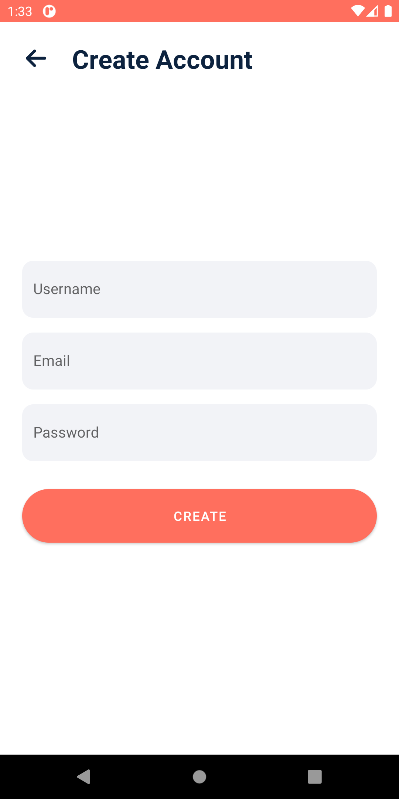
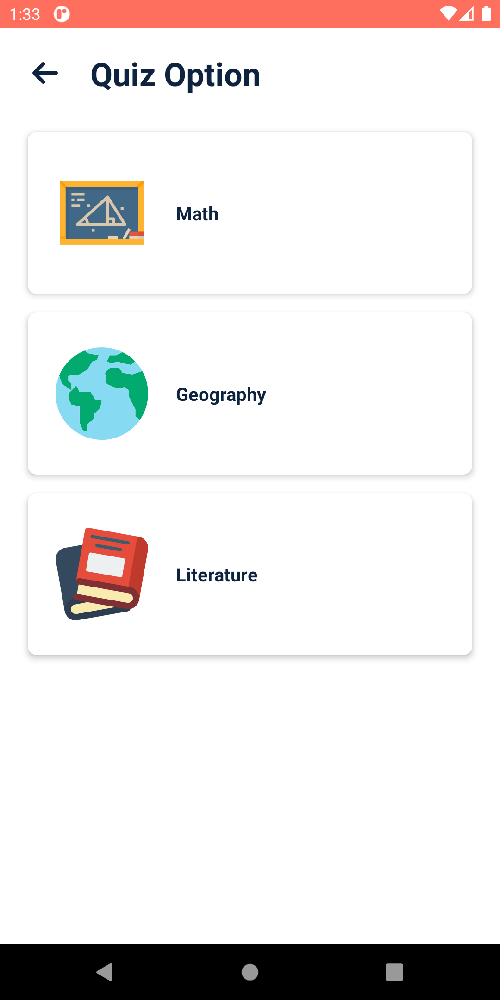
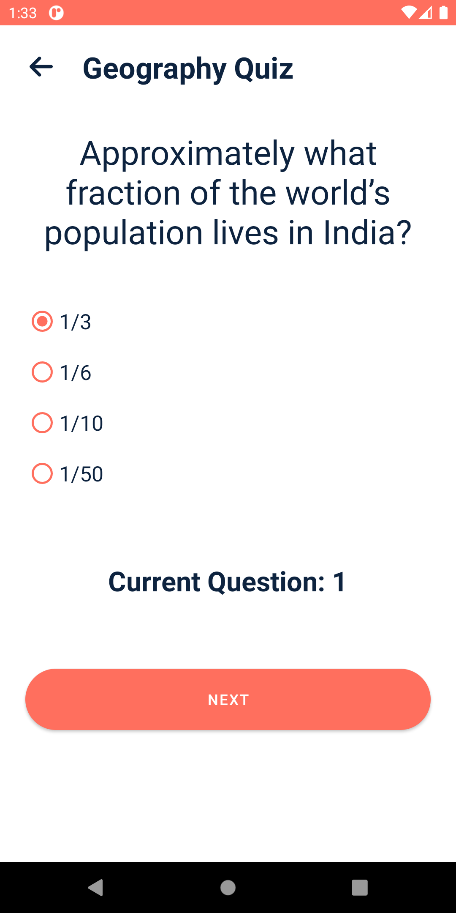
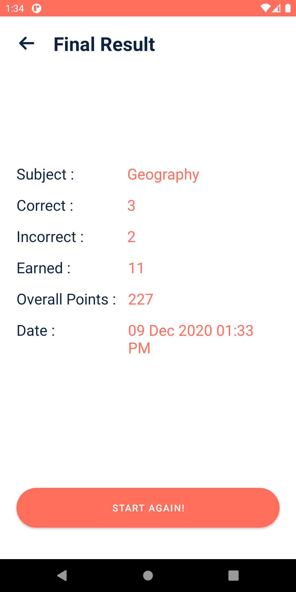
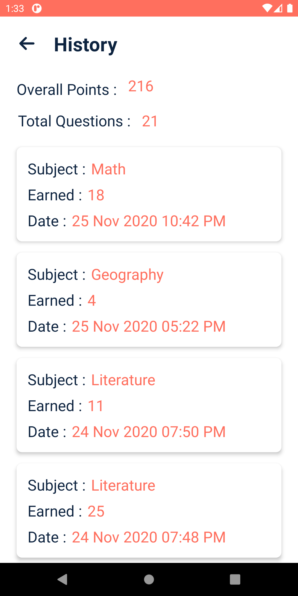
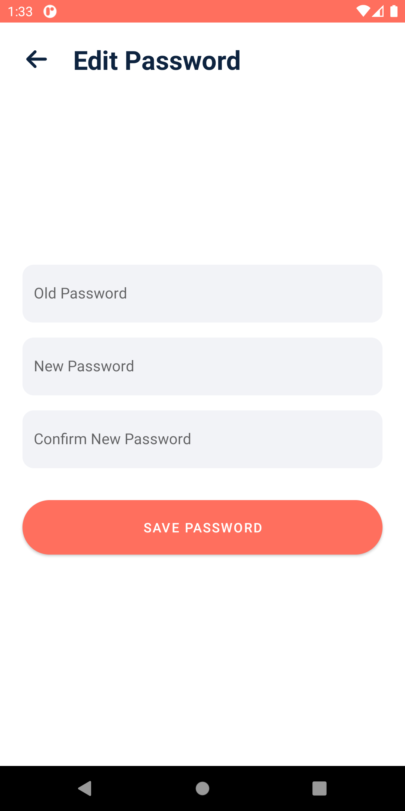

------------
## ⚙️ Features
* App consists of Quiz of primarily three subject - Maths, Geography, Literature
* Maintaining history of previous attempts of quiz using Room.
* You can switch users using the Login/Register
* Feature to change to your current password
* Added loader while data is being fetched from API
* Showing the result at the end the Quiz.
* Implemented login, register,edit password, previous attempts all using SQL Lite DB using Room 

## 🚀 Technology Used

* Quiz App is build using Java
* Asynctask for asynchronous
* Room Persistence Library

## 📸 Screenshots

||||
|:----------------------------------------:|:-----------------------------------------:|:-----------------------------------------: |
|  |  |  |
|  |  |  |
|  |  |  |
|  |  |  |

## ⚡ Dependencies Used
```sh
* Room Persistence Library 2.2.5
* Gson 2.8.6
```


FITNESS FOR A PARTICULAR PURPOSE AND NONINFRINGEMENT. IN NO EVENT SHALL THE
AUTHORS OR COPYRIGHT HOLDERS BE LIABLE FOR ANY CLAIM, DAMAGES OR OTHER
LIABILITY, WHETHER IN AN ACTION OF CONTRACT, TORT OR OTHERWISE, ARISING FROM,
OUT OF OR IN CONNECTION WITH THE SOFTWARE OR THE USE OR OTHER DEALINGS IN THE
SOFTWARE.
```
